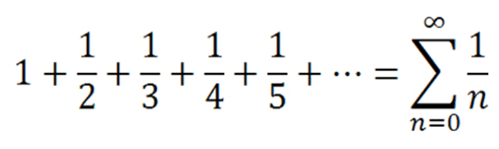

# Harmonic Number Calculator
### This program takes a number (n) from the user and calculates the sum of the harmonic series of the first n terms.

---

## Details
* **How do you calculate a harmonic number for integers?**

The "n-th harmonic number" is the partial sum of the harmonic series,

---

## Installation
Clone the project.
https://github.com/iferhatzdemir/Java_Study/tree/main/HarmonicNumbers/src

---

## Usage
After cloning the project, open it with the ide you used.

---

## Requirements
* JDK (version 19 is recommended)

---

## Author
**İbrahim Ferhat Özdemir**

* GitHub: [İbrahim Ferhat Özdemir](https://github.com/iferhatzdemir)
* LinkedIn: [İbrahim Ferhat Özdemir](https://www.linkedin.com/in/ibrahim-ferhat-%C3%B6zdemir-4304b4139/
  )
---

## Contributing
Contributions, issues, and feature requests are welcome.

---

## License

[MIT](https://choosealicense.com/licenses/mit/)

---

## Show Your Suport
Give me a &#11088; if you like the project.

---

## Acknowledgments
* This repo is created for my own projects on www.patika.dev