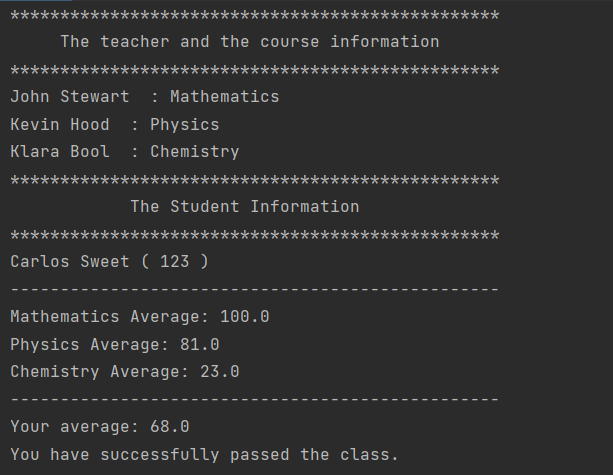

# Student Grading System

### This program manages the student, the teacher information and the student grades.

---

## Details
* This repository has
    * a Main.java class in which the program runs and prints the information
      about the teacher and the student. It also prints if the student pass the
      class or not.
    * a Teacher.java class in which teacher-related qualities and
      methods are defined.
    * a Course.java class in which course-related qualities and
      methods are defiined.
    * a Student.java class in which student-related qualities and
      methods are defined.

* Three students, three courses and three teachers are determined.
  Program output for teachers and one student will be as:

---

## Installation
Clone the project.
https://github.com/iferhatzdemir/Java_Study/tree/main/Student_Information_Systems/src

---

## Usage
After cloning the project, open it with the ide you used.

---

## Requirements
* JDK (version 19 is recommended)

---

## Author
**İbrahim Ferhat Özdemir**

* GitHub: [İbrahim Ferhat Özdemir](https://github.com/iferhatzdemir)
* LinkedIn: [İbrahim Ferhat Özdemir](https://www.linkedin.com/in/ibrahim-ferhat-%C3%B6zdemir-4304b4139/
  )
---

## Contributing
Contributions, issues, and feature requests are welcome.

---

## License

[MIT](https://choosealicense.com/licenses/mit/)

---

## Show Your Suport
Give me a &#11088; if you like the project.

---

## Acknowledgments
* This repo is created for my own projects on www.patika.dev